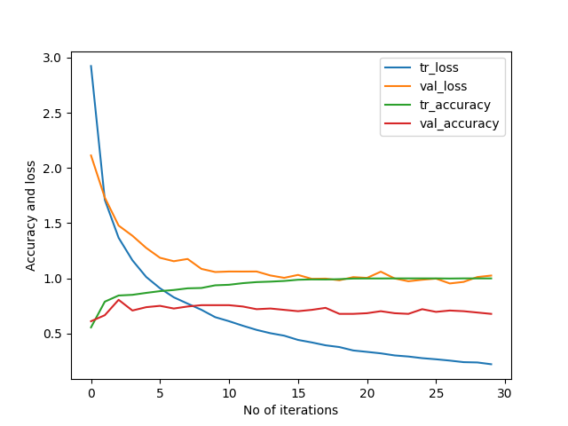

# DrivingDirection-80.6-Participant-9
Epoch 30: val_accuracy did not improve from 0.80606    
52/52 [==============================] - 1s 14ms/step - loss: 0.2227 - accuracy: 1.0000 - val_loss: 1.0257 - val_accuracy: 0.6788   
[[64 19  8]    
 [ 3 20  4]    
 [12  7 28]]   
52/52 [==============================] - 0s 3ms/step - loss: 1.2314 - accuracy: 0.8640    
6/6 [==============================] - 0s 6ms/step - loss: 1.4786 - accuracy: 0.8061      
Train: 0.864, Test: 0.806    
[[71 13  7]           
 [ 3 21  3]           
 [ 5  1 41]]            
 

